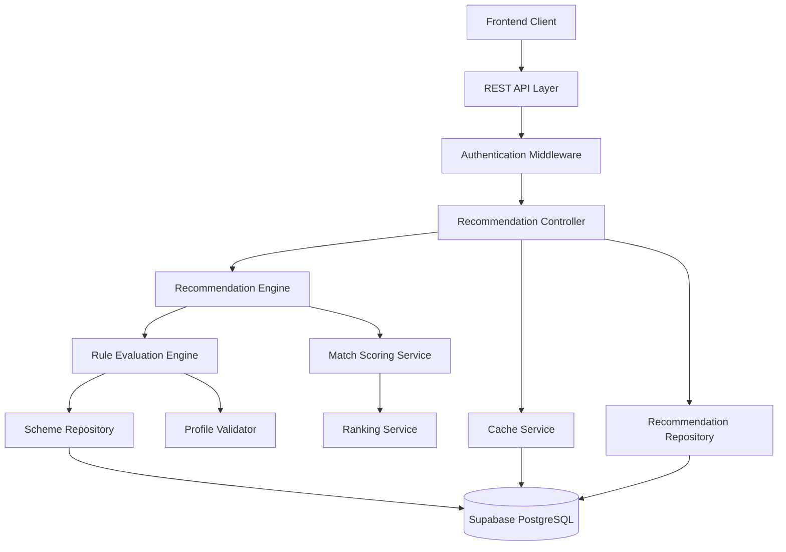

# Design Document: Personalized Scheme Recommendations

## Overview

The Personalized Scheme Recommendations feature implements a rule-based matching engine that evaluates user profiles against government scheme eligibility criteria. The system uses a scoring algorithm to rank schemes by relevance and returns structured recommendations through a REST API.

The design follows a layered architecture with clear separation between the API layer, business logic layer, and data access layer. The recommendation engine uses a rule evaluation engine that supports complex eligibility criteria with AND/OR logic, numeric ranges, categorical matches, and weighted scoring.

Key design decisions:
- **Rule-based matching over ML**: Given the need for explainability and the structured nature of eligibility criteria, we use rule-based matching rather than machine learning
- **Synchronous processing**: Recommendations are calculated on-demand rather than pre-computed, ensuring users always get results based on current scheme data
- **Caching strategy**: Recent recommendations are cached for 24 hours to improve performance for repeat queries
- **Modular rule engine**: Eligibility rules are evaluated through a pluggable rule engine that can be extended with new rule types

## Architecture



The architecture consists of the following layers:

1. **API Layer**: Handles HTTP requests, authentication, and response formatting
2. **Business Logic Layer**: Contains the recommendation engine, rule evaluation engine, and scoring logic
3. **Data Access Layer**: Manages database interactions through repositories
4. **Caching Layer**: Stores recent recommendations to improve performance

## Components and Interfaces

### 1. REST API Endpoint

**Endpoint**: `POST /api/v1/recommendations`

**Request Format**:
```json
{
  "userId": "string (optional)",
  "profile": {
    "age": "integer",
    "income": "number",
    "state": "string",
    "occupation": "string",
    "category": "string (e.g., General, OBC, SC, ST)",
    "gender": "string (optional)",
    "disabilityStatus": "boolean (optional)",
    "education": "string (optional)",
    "landHolding": "number (optional)"
  }
}
```

**Response Format**:
```json
{
  "success": true,
  "timestamp": "ISO 8601 timestamp",
  "recommendations": [
    {
      "schemeId": "string",
      "schemeName": "string",
      "description": "string",
      "benefits": "string",
      "matchScore": "number (0-100)",
      "matchPercentage": "number (0-100)",
      "eligibilityStatus": "FULLY_ELIGIBLE | PARTIALLY_ELIGIBLE",
      "unmatchedCriteria": ["string"],
      "provider": "string (e.g., Central Government, State Government)",
      "category": "string (e.g., Education, Healthcare, Agriculture)"
    }
  ],
  "totalCount": "integer",
  "message": "string (optional)"
}
```

**Error Response Format**:
```json
{
  "success": false,
  "error": {
    "code": "string",
    "message": "string",
    "details": ["string"]
  }
}
```

### 2. Recommendation Engine

**Interface**:
```typescript
interface RecommendationEngine {
  generateRecommendations(profile: UserProfile): Promise<Recommendation[]>
  evaluateEligibility(profile: UserProfile, scheme: Scheme): EligibilityResult
  calculateMatchScore(profile: UserProfile, scheme: Scheme): number
}
```

**Responsibilities**:
- Orchestrate the recommendation generation process
- Coordinate between rule evaluation, scoring, and ranking
- Handle caching and persistence of recommendations

### 3. Rule Evaluation Engine

**Interface**:
```typescript
interface RuleEvaluationEngine {
  evaluateRule(rule: EligibilityRule, profile: UserProfile): RuleResult
  evaluateRuleSet(rules: EligibilityRule[], logic: 'AND' | 'OR', profile: UserProfile): boolean
  getSupportedRuleTypes(): RuleType[]
}

type RuleType = 
  | 'NUMERIC_RANGE'      // e.g., age between 18 and 35
  | 'NUMERIC_THRESHOLD'  // e.g., income < 100000
  | 'CATEGORICAL_MATCH'  // e.g., state = 'Maharashtra'
  | 'BOOLEAN_CHECK'      // e.g., disabilityStatus = true
  | 'SET_MEMBERSHIP'     // e.g., occupation in ['Farmer', 'Agricultural Worker']
  | 'COMPOSITE'          // Nested rules with AND/OR logic
```

**Rule Evaluation Algorithm**:
```
function evaluateRule(rule, profile):
  if rule.type == NUMERIC_RANGE:
    value = profile[rule.attribute]
    return rule.min <= value <= rule.max
  
  if rule.type == NUMERIC_THRESHOLD:
    value = profile[rule.attribute]
    return compare(value, rule.threshold, rule.operator)
  
  if rule.type == CATEGORICAL_MATCH:
    value = profile[rule.attribute]
    return value == rule.expectedValue
  
  if rule.type == BOOLEAN_CHECK:
    value = profile[rule.attribute]
    return value == rule.expectedValue
  
  if rule.type == SET_MEMBERSHIP:
    value = profile[rule.attribute]
    return value in rule.allowedValues
  
  if rule.type == COMPOSITE:
    results = [evaluateRule(subRule, profile) for subRule in rule.subRules]
    if rule.logic == AND:
      return all(results)
    else:
      return any(results)

function evaluateRuleSet(rules, logic, profile):
  results = [evaluateRule(rule, profile) for rule in rules]
  if logic == AND:
    return all(results)
  else:
    return any(results)
```

### 4. Match Scoring Service

**Interface**:
```typescript
interface MatchScoringService {
  calculateScore(profile: UserProfile, scheme: Scheme, eligibilityResult: EligibilityResult): number
  getWeightedScore(matchedRules: EligibilityRule[], totalRules: number): number
}
```

**Scoring Algorithm**:
```
function calculateScore(profile, scheme, eligibilityResult):
  if eligibilityResult.fullyEligible:
    baseScore = 100
  else:
    matchedCount = count(eligibilityResult.matchedRules)
    totalCount = count(scheme.eligibilityRules)
    baseScore = (matchedCount / totalCount) * 100
  
  // Apply weights for critical criteria
  weightedBonus = 0
  for rule in eligibilityResult.matchedRules:
    if rule.weight > 1.0:
      weightedBonus += (rule.weight - 1.0) * 10
  
  finalScore = min(100, baseScore + weightedBonus)
  return finalScore
```

### 5. Ranking Service

**Interface**:
```typescript
interface RankingService {
  rankRecommendations(recommendations: Recommendation[]): Recommendation[]
  applyTieBreaker(rec1: Recommendation, rec2: Recommendation): number
}
```

**Ranking Algorithm**:
```
function rankRecommendations(recommendations):
  // Primary sort: match score (descending)
  // Secondary sort: scheme priority (descending)
  // Tertiary sort: creation date (descending)
  
  return sort(recommendations, comparator=(rec) => (
    -rec.matchScore,
    -rec.scheme.priority,
    -rec.scheme.createdAt
  ))
```

### 6. Profile Validator

**Interface**:
```typescript
interface ProfileValidator {
  validate(profile: UserProfile): ValidationResult
  validateAttribute(attribute: string, value: any): AttributeValidationResult
  getRequiredAttributes(): string[]
}
```

**Validation Rules**:
- Age: integer, 0 <= age <= 150
- Income: number, >= 0
- State: must be in predefined list of Indian states/UTs
- Occupation: string, non-empty
- Category: must be in ['General', 'OBC', 'SC', 'ST', 'EWS']
- Gender: must be in ['Male', 'Female', 'Other'] if provided
- DisabilityStatus: boolean if provided

### 7. Cache Service

**Interface**:
```typescript
interface CacheService {
  get(key: string): Promise<Recommendation[] | null>
  set(key: string, value: Recommendation[], ttl: number): Promise<void>
  invalidate(key: string): Promise<void>
  generateCacheKey(profile: UserProfile): string
}
```

**Caching Strategy**:
- Cache key: hash of normalized profile attributes
- TTL: 24 hours
- Invalidation: when user profile is updated or schemes are modified
- Storage: In-memory cache (Redis) or database table

### 8. Repository Interfaces

**Scheme Repository**:
```typescript
interface SchemeRepository {
  getAllActiveSchemes(): Promise<Scheme[]>
  getSchemeById(id: string): Promise<Scheme | null>
  getSchemesByCategory(category: string): Promise<Scheme[]>
  getSchemesByState(state: string): Promise<Scheme[]>
}
```

**Recommendation Repository**:
```typescript
interface RecommendationRepository {
  saveRecommendations(userId: string, recommendations: Recommendation[]): Promise<void>
  getRecentRecommendations(userId: string): Promise<Recommendation[] | null>
  getRecommendationHistory(userId: string): Promise<RecommendationHistory[]>
  markAsOutdated(userId: string): Promise<void>
}
```

## Data Models

### UserProfile

```typescript
interface UserProfile {
  age: number                    // Required
  income: number                 // Required (annual income in INR)
  state: string                  // Required (Indian state/UT code)
  occupation: string             // Required
  category: string               // Required (General, OBC, SC, ST, EWS)
  gender?: string                // Optional (Male, Female, Other)
  disabilityStatus?: boolean     // Optional
  education?: string             // Optional (e.g., "10th Pass", "Graduate")
  landHolding?: number           // Optional (in acres)
  maritalStatus?: string         // Optional
  familyIncome?: number          // Optional (for household schemes)
}
```

### Scheme

```typescript
interface Scheme {
  id: string
  name: string
  description: string
  benefits: string
  provider: string               // e.g., "Central Government", "Maharashtra Government"
  category: string               // e.g., "Education", "Healthcare", "Agriculture"
  eligibilityRules: EligibilityRule[]
  priority: number               // Higher priority schemes rank higher in ties
  isActive: boolean
  createdAt: Date
  updatedAt: Date
  applicationUrl?: string
  requiredDocuments?: string[]
}
```

### EligibilityRule

```typescript
interface EligibilityRule {
  id: string
  ruleType: RuleType
  attribute: string              // Profile attribute to check (e.g., "age", "income")
  operator?: ComparisonOperator  // For numeric thresholds (e.g., "<", ">=")
  value?: any                    // Expected value for categorical/boolean
  minValue?: number              // For numeric ranges
  maxValue?: number              // For numeric ranges
  allowedValues?: any[]          // For set membership
  weight: number                 // Default 1.0, higher for critical criteria
  description: string            // Human-readable description
  subRules?: EligibilityRule[]   // For composite rules
  logic?: 'AND' | 'OR'           // For composite rules
}

type ComparisonOperator = '<' | '<=' | '>' | '>=' | '==' | '!='
```

### Recommendation

```typescript
interface Recommendation {
  schemeId: string
  schemeName: string
  description: string
  benefits: string
  matchScore: number             // 0-100
  matchPercentage: number        // 0-100 (same as matchScore for display)
  eligibilityStatus: 'FULLY_ELIGIBLE' | 'PARTIALLY_ELIGIBLE'
  matchedCriteria: string[]      // Descriptions of matched rules
  unmatchedCriteria: string[]    // Descriptions of unmatched rules
  provider: string
  category: string
  applicationUrl?: string
  requiredDocuments?: string[]
}
```

### EligibilityResult

```typescript
interface EligibilityResult {
  fullyEligible: boolean
  matchedRules: EligibilityRule[]
  unmatchedRules: EligibilityRule[]
  matchCount: number
  totalCount: number
}
```

### ValidationResult

```typescript
interface ValidationResult {
  isValid: boolean
  errors: ValidationError[]
  missingRequired: string[]
}

interface ValidationError {
  attribute: string
  message: string
  providedValue: any
}
```

### Database Schema

**schemes table**:
```sql
CREATE TABLE schemes (
  id UUID PRIMARY KEY DEFAULT gen_random_uuid(),
  name VARCHAR(255) NOT NULL,
  description TEXT NOT NULL,
  benefits TEXT NOT NULL,
  provider VARCHAR(100) NOT NULL,
  category VARCHAR(50) NOT NULL,
  priority INTEGER DEFAULT 0,
  is_active BOOLEAN DEFAULT true,
  application_url TEXT,
  required_documents JSONB,
  created_at TIMESTAMP DEFAULT NOW(),
  updated_at TIMESTAMP DEFAULT NOW()
);

CREATE INDEX idx_schemes_active ON schemes(is_active);
CREATE INDEX idx_schemes_category ON schemes(category);
CREATE INDEX idx_schemes_provider ON schemes(provider);
```

**eligibility_rules table**:
```sql
CREATE TABLE eligibility_rules (
  id UUID PRIMARY KEY DEFAULT gen_random_uuid(),
  scheme_id UUID NOT NULL REFERENCES schemes(id) ON DELETE CASCADE,
  rule_type VARCHAR(50) NOT NULL,
  attribute VARCHAR(100) NOT NULL,
  operator VARCHAR(10),
  value JSONB,
  min_value NUMERIC,
  max_value NUMERIC,
  allowed_values JSONB,
  weight NUMERIC DEFAULT 1.0,
  description TEXT NOT NULL,
  sub_rules JSONB,
  logic VARCHAR(3),
  created_at TIMESTAMP DEFAULT NOW()
);

CREATE INDEX idx_eligibility_rules_scheme ON eligibility_rules(scheme_id);
```

**recommendations table**:
```sql
CREATE TABLE recommendations (
  id UUID PRIMARY KEY DEFAULT gen_random_uuid(),
  user_id UUID NOT NULL,
  profile_hash VARCHAR(64) NOT NULL,
  recommendations JSONB NOT NULL,
  is_outdated BOOLEAN DEFAULT false,
  created_at TIMESTAMP DEFAULT NOW()
);

CREATE INDEX idx_recommendations_user ON recommendations(user_id, created_at DESC);
CREATE INDEX idx_recommendations_hash ON recommendations(profile_hash, is_outdated);
```

## Correctness Properties

*A property is a characteristic or behavior that should hold true across all valid executions of a system—essentially, a formal statement about what the system should do. Properties serve as the bridge between human-readable specifications and machine-verifiable correctness guarantees.*


### Property 1: Profile Validation Correctness
*For any* user profile with valid attribute values (age in 0-150, income >= 0, state in valid list, etc.), validation should accept the profile, and *for any* profile with invalid values, validation should reject it with specific error messages.
**Validates: Requirements 1.1, 1.5, 1.6, 1.7**

### Property 2: Missing Required Attributes Detection
*For any* user profile missing one or more required attributes (age, income, state, occupation, category), the system should identify all missing required attributes in the validation result.
**Validates: Requirements 1.2**

### Property 3: Profile Update Persistence
*For any* valid profile update, persisting the update and then retrieving the profile should return the updated values.
**Validates: Requirements 1.4**

### Property 4: All Active Schemes Evaluated
*For any* user profile, the recommendation engine should evaluate the profile against every active scheme in the database.
**Validates: Requirements 2.1**

### Property 5: Complete Rule Evaluation
*For any* scheme with multiple eligibility rules, the recommendation engine should evaluate all rules when determining eligibility.
**Validates: Requirements 2.2, 6.2**

### Property 6: Full Eligibility Detection
*For any* user profile that satisfies all eligibility rules of a scheme, the scheme should be marked as fully eligible with a match score of 100.
**Validates: Requirements 2.3**

### Property 7: Partial Match Scoring
*For any* user profile that satisfies some but not all eligibility rules of a scheme, the system should calculate a partial match score between 0 and 100 based on the proportion of satisfied rules.
**Validates: Requirements 2.4**

### Property 8: Missing Attribute Ineligibility
*For any* user profile missing an attribute that a scheme requires, that scheme should be marked as ineligible or have a reduced match score.
**Validates: Requirements 2.6**

### Property 9: Recommendation Ranking Order
*For any* set of recommendations with different match scores, the recommendations should be sorted in descending order by match score.
**Validates: Requirements 3.1**

### Property 10: Score Monotonicity
*For any* two schemes where scheme A has more satisfied eligibility criteria than scheme B (for the same profile), scheme A should have a match score greater than or equal to scheme B's match score.
**Validates: Requirements 3.2**

### Property 11: Tie-Breaking Consistency
*For any* two schemes with equal match scores, the ranking should be consistent and determined by scheme priority or creation date.
**Validates: Requirements 3.3**

### Property 12: Minimum Result Set Size
*For any* user profile where at least 10 schemes are eligible, the system should return at least 10 recommendations.
**Validates: Requirements 3.4**

### Property 13: Partial Match Fallback
*For any* user profile where no schemes are fully eligible but some schemes are partially eligible, the system should return the partially matching schemes ranked by match score.
**Validates: Requirements 3.5**

### Property 14: Recommendation Output Completeness
*For any* generated recommendation, the output should contain scheme name, description, benefits, eligibility summary, and match score.
**Validates: Requirements 4.1, 4.2**

### Property 15: Unmatched Criteria Reporting
*For any* partially matched scheme, the recommendation should identify which specific eligibility criteria were not met.
**Validates: Requirements 4.3**

### Property 16: Scheme Retrieval Completeness
*For any* scheme stored in the database with eligibility rules, retrieving that scheme should return all associated eligibility criteria.
**Validates: Requirements 5.3**

### Property 17: Criteria Update Immediacy
*For any* scheme whose eligibility criteria are updated, generating new recommendations immediately after the update should use the new criteria.
**Validates: Requirements 5.5**

### Property 18: All Attributes Considered
*For any* user profile, changing any provided attribute value should potentially affect the recommendation results (unless the attribute is irrelevant to all schemes).
**Validates: Requirements 6.1**

### Property 19: Weighted Scoring Effect
*For any* scheme with weighted eligibility rules, the match score should reflect the weights such that satisfying higher-weighted rules contributes more to the score.
**Validates: Requirements 6.3**

### Property 20: Conflict Ineligibility
*For any* user profile where an attribute value directly conflicts with a scheme's eligibility requirement (e.g., age 25 when scheme requires age < 18), the scheme should be marked as ineligible.
**Validates: Requirements 6.4**

### Property 21: Optional Attribute Tolerance
*For any* user profile missing optional attributes, schemes that only require those optional attributes (not as mandatory) should not be automatically marked as ineligible.
**Validates: Requirements 6.5**

### Property 22: Recommendation Persistence with Timestamp
*For any* generated recommendations, persisting them and then retrieving them should return the same recommendations with a valid timestamp.
**Validates: Requirements 7.1**

### Property 23: Most Recent Retrieval
*For any* user with multiple recommendation sets generated at different times, retrieving recommendations should return the most recently generated set.
**Validates: Requirements 7.2**

### Property 24: Outdated Marking on Update
*For any* user profile update, all previously generated recommendations for that user should be marked as outdated.
**Validates: Requirements 7.3**

### Property 25: Cache Hit Within TTL
*For any* user profile, if recommendations were generated within the last 24 hours, requesting recommendations again should return the cached results without recalculation.
**Validates: Requirements 7.5**

### Property 26: Validation Error Specificity
*For any* user profile with multiple invalid attributes, the validation error response should contain specific error messages for each invalid attribute.
**Validates: Requirements 8.2**

### Property 27: API Status Code Correctness
*For any* API request, the response should have an appropriate HTTP status code (200 for success, 400 for validation errors, 401 for authentication failures, 500 for server errors).
**Validates: Requirements 9.2**

### Property 28: Authentication Enforcement
*For any* API request when authentication is required, requests with invalid or missing tokens should be rejected with 401 status, and requests with valid tokens should be processed.
**Validates: Requirements 9.5**

## Error Handling

The system implements comprehensive error handling at multiple layers:

### Validation Errors
- **Invalid profile attributes**: Return 400 Bad Request with specific validation errors
- **Missing required attributes**: Return 400 Bad Request with list of missing attributes
- **Type mismatches**: Return 400 Bad Request with type error details

### Database Errors
- **Connection failures**: Return 503 Service Unavailable with retry-after header
- **Query timeouts**: Return 504 Gateway Timeout with partial results if available
- **Constraint violations**: Return 400 Bad Request with constraint details

### Business Logic Errors
- **No schemes available**: Return 200 OK with empty recommendations array and informative message
- **No matching schemes**: Return 200 OK with empty or partial match recommendations
- **Invalid scheme data**: Log error, skip invalid scheme, continue processing

### Authentication Errors
- **Missing token**: Return 401 Unauthorized
- **Invalid token**: Return 401 Unauthorized
- **Expired token**: Return 401 Unauthorized with token refresh hint

### Performance Errors
- **Calculation timeout**: Return 504 Gateway Timeout with partial results if available
- **Rate limiting**: Return 429 Too Many Requests with retry-after header

### Error Response Format
All errors follow a consistent format:
```json
{
  "success": false,
  "error": {
    "code": "ERROR_CODE",
    "message": "Human-readable error message",
    "details": ["Specific error detail 1", "Specific error detail 2"]
  }
}
```

### Logging Strategy
- **Error logs**: All errors with stack traces, request context, and user ID
- **Warning logs**: Partial matches, missing optional data, performance degradation
- **Info logs**: Successful recommendations, cache hits/misses
- **Debug logs**: Rule evaluation details, scoring calculations (disabled in production)

## Testing Strategy

The testing strategy employs a dual approach combining unit tests for specific scenarios and property-based tests for universal correctness guarantees.

### Property-Based Testing

Property-based testing will be implemented using **fast-check** (for TypeScript/JavaScript) or **Hypothesis** (for Python) to verify the correctness properties defined above. Each property test will:

- Run a minimum of 100 iterations with randomly generated inputs
- Be tagged with a comment referencing the design property
- Tag format: `// Feature: personalized-scheme-recommendations, Property N: [property text]`
- Generate diverse test data including edge cases (empty profiles, extreme values, boundary conditions)

**Example Property Test Structure**:
```typescript
// Feature: personalized-scheme-recommendations, Property 1: Profile Validation Correctness
test('valid profiles should pass validation', async () => {
  await fc.assert(
    fc.asyncProperty(
      validProfileGenerator(),
      async (profile) => {
        const result = await profileValidator.validate(profile);
        expect(result.isValid).toBe(true);
        expect(result.errors).toHaveLength(0);
      }
    ),
    { numRuns: 100 }
  );
});
```

**Generators Required**:
- `validProfileGenerator()`: Generates profiles with all valid attributes
- `invalidProfileGenerator()`: Generates profiles with various invalid attributes
- `schemeGenerator()`: Generates schemes with random eligibility rules
- `eligibilityRuleGenerator()`: Generates various types of eligibility rules
- `partialProfileGenerator()`: Generates profiles with missing optional attributes

### Unit Testing

Unit tests complement property tests by focusing on:

1. **Specific Examples**: Concrete scenarios that demonstrate correct behavior
   - Example: A 25-year-old farmer from Maharashtra should match agricultural schemes
   - Example: A student under 18 should match education schemes

2. **Edge Cases**: Boundary conditions and special scenarios
   - Empty database (no schemes available)
   - Profile with all optional attributes missing
   - Scheme with no eligibility rules
   - Profile at exact boundary values (age = 18, income = 0)

3. **Integration Points**: Component interactions
   - API endpoint to controller to engine flow
   - Database connection and query execution
   - Cache hit and miss scenarios

4. **Error Conditions**: Specific error scenarios
   - Database connection failure
   - Invalid JSON in request
   - Authentication token expiration

**Unit Test Balance**: Focus unit tests on integration points and specific examples. Avoid writing many unit tests for input variations—property-based tests handle comprehensive input coverage more effectively.

### Test Coverage Goals

- **Line coverage**: Minimum 80%
- **Branch coverage**: Minimum 75%
- **Property coverage**: 100% of defined correctness properties
- **Critical path coverage**: 100% (profile validation, eligibility evaluation, scoring, ranking)

### Testing Layers

1. **Unit Tests**: Individual functions and classes
   - Profile validator
   - Rule evaluation engine
   - Scoring service
   - Ranking service

2. **Integration Tests**: Component interactions
   - API endpoint to recommendation engine
   - Repository to database
   - Cache service integration

3. **Property Tests**: Universal correctness properties
   - All 28 properties defined in Correctness Properties section
   - Each property implemented as a separate test

4. **End-to-End Tests**: Full user flows (limited, focus on critical paths)
   - Submit profile → receive recommendations
   - Update profile → receive updated recommendations
   - Authentication → authorized access

### Mock Strategy

- **Database**: Mock for unit tests, use test database for integration tests
- **External services**: Mock authentication service for unit tests
- **Cache**: Use in-memory cache for tests
- **Time**: Mock time functions for cache TTL testing

### Continuous Integration

- Run all tests on every commit
- Property tests run with 100 iterations in CI
- Performance benchmarks run nightly
- Test results reported in pull requests
